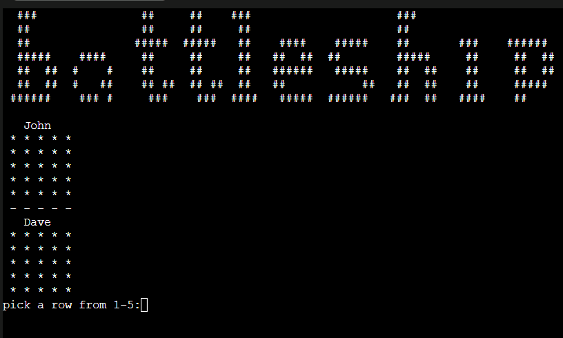
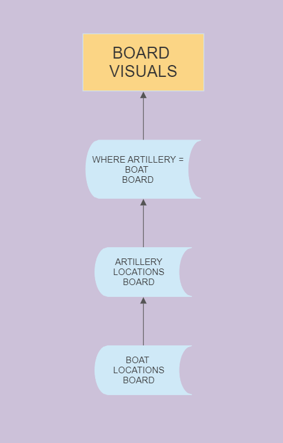
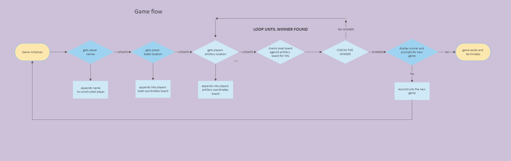
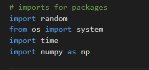

# Battleship - Terminal Game
A web based terminal game for a player to play against a computer in a game of battleship. 

\
[Click here to play the game](https://project-three-battleships-4343f96bbd75.herokuapp.com/)

* [User Experience (UX)](#user-experience-ux)
  * [Initial Discussion](#initial-discussion)
  * [User Stories](#user-stories)
* [Design](#design)
  * [Flow Chart Planning](#flow-chart-planning)
  * [Features](#features)
* [Technologies Used](#technologies-used)
  * [Languages Used](#languages-used)
  * [Libraries & Programs Used](#libraries--programs-used)
* [Deployment & Local Development](#deployment--local-development)
  * [Deployment](#deployment)
* [Testing](#testing)
  * [W3C Validator](#w3c-validator)
  * [Solved Bugs](#solved-bugs)
  * [Known Bugs](#known-bugs)
  * [Tesing User Stories](#testing-user-stories)
  * [Full Testing](#full-testing)
* [Credits](#credits)
* [Media](#media)
* [Acknowledgments](#acknowledgments)

## User Experience (UX)
### Initial Discussion
Battleship is a game usually played with two players, where they place their ships and fire artillery to try and sink the opponents ship. 
this is a digital rendition of the classic board game. 
 

### User Stories
#### First Time Player Goals
* To quickly be able to play the game without knowing the rules.
* for quick gameplay to be carried out, resulting in a fast-paced rewarding feeling when played. 
#### Returning Player Goals
* To be able to play a different game-set everytime - with the computer choosing different locations/artillery calls every game.

## Design
As this game was created to be played via the terminal, there are limitations as to the customisation of the design. With this particular deployment, the terminal window is limited to
80 characters in length, with a restriction of 24 rows in height. Because of these limitations, the main focus would be the board and the ASCII art banner. With only a small amount of 
on screen information, this allows the player to not be distracted and continue focus on the game. 

### Flow Chart Planning
\
When designing how the game would update visuals and process input, i decided on doing a stacked visual process. This allows the game to do all proccessing in the backend without
disturbing/interrupting the games visuals. This seperation of game-states also makes writing the logic substantially easier. 

The above documents a rough flow chart of the game logic/process and streamlined how i would create the project. 

## Technologies Used 

### Languages & Packages Used 
\
Python was the sole language used for this terminal game project, utlizing a few imports for the board creation and other useful functions. 

* packages:
  * random for its random number generation methods.
  * os - system to allow me to use the system('clear') function which clears the terminal window. 
  * time for the sleep() function which allows a specific block of code to wait a given time in seconds before executing. 
  * numpy for the creation of 2d arrays and its methods when working with 2d arrays.

### Libraries & Programs Used
Github was used as a repository to store website files and code.  
Gitpod used as the coding environment with git for version control.  
Google Dev Tools were used for troubleshooting and testing media queries for multiple device viewports.  
Google Fonts used to import website fonts.  
Font awesome used to import icons used throughout the website.  

## Deployment & Local Development

### Deployment
Github Pages was used to deploy the live website.  
This can be acheived by following:  
  1. Log into your github account
  2. Select the repository you wish to go live with.
  3. Open the repository settings. 
  4. In your source selection, select main from your branch drop down menu, then select root from your folder menu. 
  5. Click the associated save button and your page will then be deployed via the shown URL. 

## Forking/Cloning 
To create a fork for this repository: 
* Navigate to the url - https://github.com/DavidUWL/Project-two
  * In the top right corner, click on the Fork dropdown. 
  * Create a new fork
  * Name the repository and/or give it a description - Click create fork. 
* You have now created a fork of this repository! 

## Testing
Throughout the creation of this website build, Google/Chrome dev tools were used to troubleshoot and test different 
elements as they were added, along with the use of the debugger keyword and variable logging to the console. Dev tools was also used to verify the websites responsiveness across multiple viewing platforms.  
 

### W3C Validator
The HTML and CSS code of this site was validated with the use of the W3C validator and jShint. 

    

    

### Solved Bugs
* During the project a few javascript bugs were encountered, namely:  
  * A bug where when playing against the computer, the buttons would not be disabled after the first round. This was countered by having the newRound function call the function that disabled the P2 buttons when a new round starts. 
  * A bug where the scorecard would not update on reset, this was due to the roundwinner key not being emptied before calling the updateScoreUI() function. 
  * A bug that made it look like win conditions were being fulfilled, however the updateScoreUI() function was being called too early.
  * A bug where regardless of the player 2 pick, the computer would force a choice over it, this was remedied by wrapping the playAgainstAI() code block in an if statement that verifies if the player2.choice value is truthy and does not execute. 

### Known Bugs
* During the developement, i used the play against the computer function so that i did not have to constantly select choices for player 2. This helped to test other functions, what i didn't consider was that i needed the option for player two to make no choice at all and the game to default. Currently the game will make a selection for player two if they do not make a choice, i do plan in the future to allow player 2 to make no choice at all and the current round will reset. 
* Depending on the screen resolution, the home page buttons will be pushed into the footer slightly. This was missed in the testing using dev tools. it will be corrected in a future commit. 

### Testing User Stories 
#### First time Vistor
* To quickly be able to see the rules and play the game.
  * Home page directs the user quickly with the minimalist design and large buttons linking to the respective pages. 
* Have a sense of familiarity with rock paper scissors but learn the extra complexity of the extra two choices.
  * The game is played just like normal, but the extra two choices are naturally folded in via the game page. 
#### Returning Visitor
 *  To be able to quickly access the game without needing to read the rules beforehand. 
   * Play accessible through all navigable pages. 

## Full testing
A number of methods were used to fully test this website.
* Two browsers were used:
  * Firefox
  * Google Chrome

* Three devices were used:
  * Desktop PC with three different resolution monitors. 
  * Huawei p30 phone.
  * Samsung Galaxy Tab A Tablet.

* Links 
  1. Home page buttons and nav bar links interacted with across multiple device resolutions to maintain usability with media query restructuring. 
  2. Footer links tested that they link to their corresponding websites. testing that when the link is interacted with, it opens a new window to allow the user to maintain their position on the current website. 

* Game section choice options
  * all choices interacted with from both opening positions of player one and player two. 
  * Verified that if player playing is playing against computer, that player 2 buttons are disabled. 
  * When each round ends, that all buttons are disabled. 
  * Tested all buttons across different screen resolutions to verify media queries do not interfere with interactions. 

## credits
### Content
All content on this site was written by myself for the game RPSLS. 

## Media
All images on this site were used with the permission of the owners/people involved. 

[Akshay bahadur image](https://static.wixstatic.com/media/903056_39aa9523c70a428684be9744580b0b1b~mv2.png/v1/fill/w_844,h_844,al_c,q_90,usm_0.66_1.00_0.01,enc_auto/903056_39aa9523c70a428684be9744580b0b1b~mv2.png)  
  
 

## Acknowledgments
[Aleks G](https://stackoverflow.com/a/66565163) For the excellent tip on flex box footer formatting.   
[Derek Mcauley](https://github.com/derekmcauley7) For his guidance as my Code Institute mentor.  
[kera cudmore](https://github.com/kera-cudmore/readme-examples/blob/main/milestone1-readme.md) For her fantastic Readme Template.