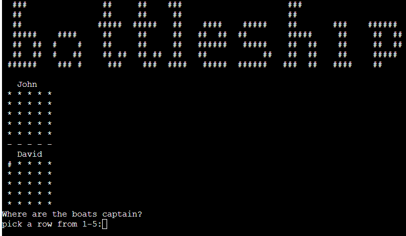

# Battleship - Terminal Game
A web based terminal game for a player to play against a computer in a game of battleship. 

\
[Click here to play the game](https://project-three-battleships-4343f96bbd75.herokuapp.com/)

* [User Experience (UX)](#user-experience-ux)
  * [Initial Discussion](#initial-discussion)
  * [User Stories](#user-stories)
* [Design](#design)
  * [Flow Chart Planning](#flow-chart-planning)
  * [Features](#features)
* [Technologies Used](#technologies-used)
  * [Languages Used](#languages-used)
  * [Libraries & Programs Used](#libraries--programs-used)
* [Deployment & Local Development](#deployment--local-development)
  * [Deployment](#deployment)
* [Testing](#testing)
  * [Solved Bugs](#solved-bugs)
  * [Known Bugs](#known-bugs)
  * [Tesing User Stories](#testing-user-stories)
  * [Full Testing](#full-testing)
* [Credits](#credits)
* [Media](#media)
* [Acknowledgments](#acknowledgments)

## User Experience (UX)
### Initial Discussion
Battleship is a game usually played with two players, where they place their ships and fire artillery to try and sink the opponent's ship. 
This is a digital rendition of the classic board game. 
 

### User Stories
#### First Time Player Goals
* To quickly be able to play the game without knowing the rules.
* For quick gameplay to be carried out, resulting in a fast-paced rewarding feeling when played. 
#### Returning Player Goals
* To be able to play a different game-set every time - with the computer choosing different locations/artillery calls every game.


## Design
As this game was created to be played via the terminal, there are limitations as to the customisation of the design. With this particular deployment, the terminal window is limited to
80 characters in length, with a restriction of 24 rows in height. Because of these limitations, the main focus would be the board and the ASCII art banner. With only a small amount of 
on screen information, this allows the player to not be distracted and continue focus on the game. 

### Flow Chart Planning
 <br>
When designing how the game would update visuals and process input, i decided on doing a stacked visual process. This allows the game to do all processing in the backend without
disturbing/interrupting the games visuals. This separation of game-states also makes writing the logic substantially easier. 


The above documents a rough flow chart of the game logic/process and streamlined how I would create the project. 

### Features 
#### Getting the player name

* Simple and concise, prompts the player for the names to be used which would be displayed next to the corresponding board. 

#### Getting the placement of the active players boats

* Prompts the player for a row and column to place their boats, boats are currently limited to a 1x1 placement, and 5 boats in total are used. 

#### Presenting the board and legend

* Presents the legend to the player for their active boats('#'), hits('X') and misses('~'). 

#### Calling the artillery 

* Similiar to the boat locations, prompts for a row and column to fire artillery at. If its a hit or miss, this will be reflected on the board. if the player
tries to fire at the same location twice, they will be prompted that they have already fired there. 

#### Computer firing coordinates

* Computer will generate a coordinate, validated to not be the same coordinate twice. This will then be printed and board updated to reflect the artillery coordinate. 

#### Presenting the winner/ Play again

* Winner is presented at the end of a round* if they have destroyed all opponents boats.
  * *A round is defined as both players calling artillery and board checked for boats, not just a single players turn. 

#### validation 

* Validation is applied to all user inputs, input cannot be empty and must be within the confines of the board. 


## Technologies Used 

### Languages & Packages Used 
\
Python was the sole language used for this terminal game project, utlizing a few imports for the board creation and other useful functions. 

* packages:
  * random for its random number generation methods.
  * os - system to allow me to use the system('clear') function which clears the terminal window. 
  * time for the sleep() function which allows a specific block of code to wait a given time in seconds before executing. 
  * numpy for the creation of 2d arrays and its methods when working with 2d arrays.

### Libraries & Programs Used
Github was used as a repository to store website files and code. <br>
Gitpod used as the coding environment with git for version control. <br>

#### ASCII art 
An ascii art banner was used to make the terminal window a bit more appealing, however i found too much ASCII art to be distracting to the gameplay. Due to only one instance of ASCII art being used, it was defined as a function call. If more ASCII art was used, a package would be imported eg - art. 


## Deployment & Local Development

### Deployment
Github Pages was used to deploy the live website. <br>
This can be acheived by following: <br>
  1. Log into your github account
  2. Select the repository you wish to go live with.
  3. Open the repository settings. 
  4. In your source selection, select main from your branch drop down menu, then select root from your folder menu. 
  5. Click the associated save button and your page will then be deployed via the shown URL. 

## Forking/Cloning 
To create a fork for this repository: 
* Navigate to the url - https://github.com/DavidUWL/p3-battleships
  * In the top right corner, click on the Fork dropdown. 
  * Create a new fork
  * Name the repository and/or give it a description - Click create fork. 
* You have now created a fork of this repository! 
To create a clone of this repository:
* Navigate to the url - https://github.com/DavidUWL/p3-battleships
  * Click on the "code" button and select which format you would like to clone with and copy that link.
  * In your Terminal window of whichever IDE you use, navigate to the whichever directory you want to clone the project to. 
  * type into the terminal "git clone", you have now cloned the project! 


## Testing
As this game is based in the terminal, and all user interactions are via inputs from the user - validation and testing is incredibly important. All player inputs contain validation, an example being the below:

```python 
    def coordinate_validation(value):  
        while True:
            try:
                value = int(value)
                if value < 1 or value > 5:
                    print("Choose between 1 and 5.")
                else:
                    break

            except ValueError:
                print("Have you forgotten numbers captain!?")

            value = input("choose from 1-5:")
        return value

```
The Majority of inputs in this game are integers, so defining a function that validates if the input is an integer and also within the confines of the board seemed appropriate. If the value is not an integer, it will throw a ValueError and print a quip, while also re-promping for a correct type value. 
<br>

Another example would be the prompt_new_game() function, however its usage is not something i would recommend, but fitted its use case:

```python 
    def prompt_new_game():
        start_new_game = str(input("Would you like to play again? \n Y/N:").upper())

        if start_new_game == "Y":
            clear()
            new_game()
        elif start_new_game == "N":
            sys.exit()
        else:
            prompt_new_game()
```
The above is a very low level recursive function, where if the player has not entered either expected input, it will call itself again. I found this an interesting way to implement validation, but if its use case involved multiple interactions i would deem it too dangerous due to its infinite loop nature. 

### Solved Bugs
* During the project a few bugs were encountered, namely: <br>
  * When print f string literals, it was forgotten that i would need to add 1 to the printing of the computer generated artillery coordinates, as they were generated with zero indexing in mind.
  * A large bug was identified where the board would not update to where player 2 would hit player 1's boats. This was due to a plot_coordinate() function call in the update_UI() function. This was placed so that the users input felt a bit snappier, however would overwrite any UI updates that would be pushed for hits. Once removed this bug was resolved. 
  * A bug where validation was not being applied to the player2 name, this was due to player2 not being passed as an argument to the function. 

### Known Bugs
* At the time of submission, i am not aware of any bugs present.  

### Testing User Stories 

#### First time Vistor
* To quickly be able to play the game without knowing the rules.
  * Players can quickly enter the game, as there are no rules to read, all inputs are prompted when needed with their application. 
* For quick gameplay to be carried out, resulting in a fast-paced rewarding feeling when played. 
  * Upon opening the game, all that is required are names and coordinates, the speed at which is is carried out solely depends on the player. 
#### Returning Visitor
 * To be able to play a different game-set everytime - with the computer choosing different locations/artillery calls every game. 
   * As player boats are chosen by the player and computer boats are placed randomly, the boardset will always be different. The computer will also pick random artillery coordinates for every game. 

## Full testing
Extensive manual testing was carried out to validate that all unexpected data types would be caught and reprompt the user for the correct data type, for example:
* Integers as floating points.
* inputs that were left empty as opposed to containing coordinates or names.
* coordinates that were fired the same place twice, which cannot occur in the original game. 
* Trying to stack boats on top of each other. 

### Lintner
All code passes through the Code Institute lintner with no errors, except for line length which is not deemed as excessive. 


## credits
### Content
All content for this game was created and written by me - David Kirby.

## Media
[ASCII.co.uk](https://ascii.co.uk/art/battleship) ASCII for the ASCII banner.

 
## Acknowledgments
[Derek Mcauley](https://github.com/derekmcauley7) For his guidance as my Code Institute mentor. <br>
[Kera cudmore](https://github.com/kera-cudmore/readme-examples/blob/main/milestone1-readme.md) For her fantastic Readme Template.